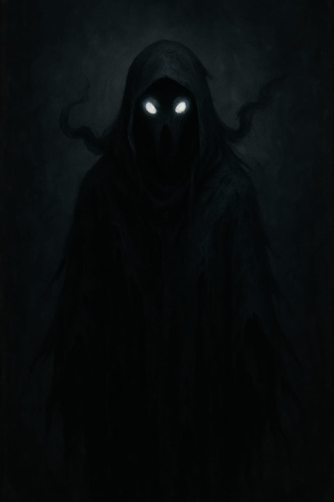
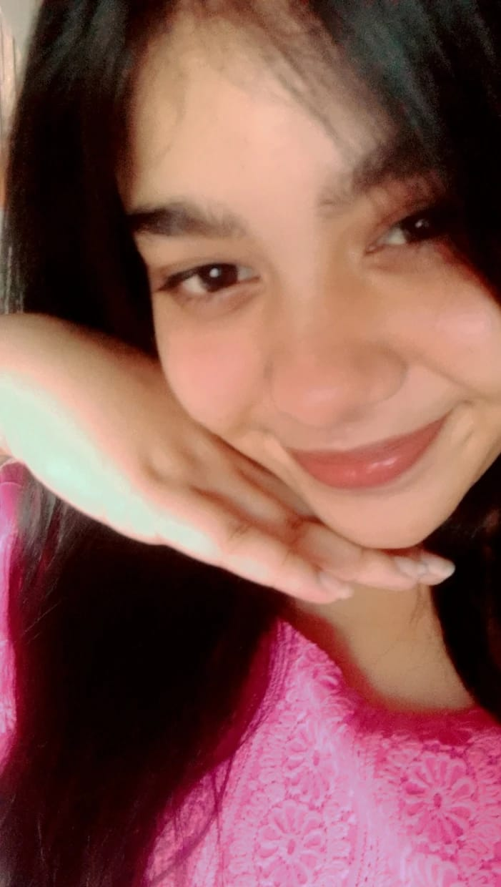

<head>
  <meta charset="UTF-8" />
  <meta name="viewport" content="width=device-width, initial-scale=1.0" />
  <title>THE LOST WEB</title>
  
</head>
<body> <audio autoplay loop>
  <source src="https://files.freemusicarchive.org/storage-freemusicarchive-org/music/no_curator/Myuu/The_Dark_Piano/Myuu_-_Ghost_Story.mp3" type="audio/mpeg">
</audio>
  <audio autoplay loop>
    <source src="creepy-music.mp3" type="audio/mpeg" />
    Your browser does not support the audio element.
  </audio>  <nav>
    <a href="#home">Home</a>
    <a href="#about">About</a>
    <a href="#witchy">This Witchy</a>
    <a href="#blogs">Blogs</a>
    <a href="#games">Games</a>
    <a href="#adios">Adios</a>
  </nav>  <section id="home">
    <h2>Welcome to the Realm 🌑</h2>
    
Step into a space of magic, mystery, and fun. Welcome to my ghosty-cool web realm!

  </section>  <section id="about">
    <h2>About Me</h2>
    
    
I’m Kamakshi, your local gaming witch coder ✨. I build magic through code, poems, and games. This place is all me — haunting, healing, and hella fun.

  </section>  <section id="witchy">
    <h2>This Witchy</h2>
    
    
Hi there! I'm Kamakshi and this is my first time creating a website where I blog and maybe live. About myself I'm 18 and I'm very much interested in gaming and doing nothing but also a little bit of coding. I love making friends, and in person I maybe an extrovert but I'm not much confident if you ask me but that's ok. That's how life works right!?. I might not be perfect and neither is this website but I hope y'all like it 🙂. Thanks for being here. Toddles!

  </section>  <section id="blogs">
    <h2>Blogs</h2>
    

      
Blog 1: Its been a rough day and while blaming god for everything that's happening in my life I realised what the actual problem was and so here I'm discussing about THE REAL PROBLEM......with this poem-----> There's nothing more important to me than to be... to live...to feel but still the question echoes: is it truly necessary? Alone without love, no tender care to cradle my heart, seeking souls to halt this solitude, but shadows chase me still, like demons dancing in the dark of my restless mind. The world once sparkled bright in solitary glow, but now I'm encircled by strangers whose hearts are void, each glance a dagger, every word a wound, they bury my hope deeper than any weapon can wound. Innocence was my shroud, believing in binds of closeness, convincing myself it’s me, that I’m the flaw, but no, no, no— I’m just a marionette, strings pulled for their delight, yet I’ve grown; perhaps my heart remains a timid child, screaming silently, longing to cry, longing to be whole, and still I know, the mirror reflects the problem within me, cause yes! the problem is me.....

23/06/2025

      
Blog 2: I've been realising lately that everything I do will never be enough or maybe...... I'M NOT ACTUALLY DOING ENOUGH------>

Crying in silence, running through pain, Screaming inside like a voice in the rain. I've given my all, done more than I could, Yet still I'm unseen, misunderstood.

For those that I love, I’ve carried the weight, Faced every storm, surrendered to fate. But they look at me with eyes so cold, And I’m lost in stories I've already told.

Lost in the past, in shadows I flee, Trapped in a place I never wished to be. I wonder aloud—what do I desire? When did my soul lose its fire?

I’ve become someone I never planned, A stranger shaped by unseen hands. Not cruel, not heartless, not a foe— Just tired, just broken, moving slow.

They say I’m wrong, they think I’m weak, But maybe I’m just too soft to speak. Maybe my love was never enough To heal the cracks, to smooth the rough.

I’ve searched within, I’ve tried my best, But some battles don’t end in rest. Now I stand with nothing left to prove, Just the ache of all I couldn’t move.

So if I seem like I’m drifting apart, Know it’s not hate—it’s a heavy heart. I gave my all, yet here I stand, Still wondering if I was ever enough... in anyone’s hands......

24/06/2025

"Temporary Us"
by Kamakshi

I always knew who I was
a shadow I never truly liked.
Maybe God had plans to heal me,
or maybe… to break me twice.

Then you came—
like sunlight through a stormed sky,
told me I was special,
held me like no one else tried.
Loved me loud,
until I believed maybe I was worth it,
even though deep down,
I knew… it was temporary.

I’ve always feared the end.
The leaving.
The silence after "forever" fades.
And now I see it
the slow turning of the tables,
the way your eyes no longer stay.

It’s not your fault.
I know.
But it still hurts to see you
look at me like the rest do
like I’m the villain in a story
I never meant to write.

I want to let you go,
to watch you fly,
to see you smile even if
that smile isn’t mine.
But the selfish ache in me
clings to the memory
of when we were us
not just me.

We promised, didn’t we?
To always be.
But even forever can be
just a fleeting dream.
And I thought knowing the end
would make it easier
but I was wrong.

Now I can’t eat,
can’t sleep,
can’t even swallow
without pain sinking deep.
Each time your lips
speak another girl's name,
I swear
it carves me like a flame.

I know I’m not enough.
Maybe I never was.
But you…
you deserved the stars,
and I was just a moment
on your map of Mars.

Still, those small, glowing moments—
even if they were just pixels and light—
were the best chapters of my life.

I’m sorry
for the chaos I brought.
I’m sorry
for being a storm you never sought.
But if love counts for anything—
I swear,
I loved you with all I had to give.

I just want to rewind
just once
to feel whole again.
But maybe this pain…
maybe it’s mine to bear.
Maybe I deserve it.

Maybe I was never meant
to be anything
but
Temporary.

    

  </section>   

<section id="adios" style="background-color: #0a0a0a; color: #fff; padding: 4rem; font-family: 'Creepster', cursive;">
  <h2 style="text-align: center; text-decoration: underline; font-size: 2.5rem;">🌙 Adios</h2>
  

    Thank you for exploring my little spooky world! 
    This was just a witchy beginning—more chaos, more spells, and more stories will brew soon. 
    Stay weird, stay magical. ✨🧙‍♀️💀  
    Adios, fellow night crawler!
  

    </section>
    </body>
